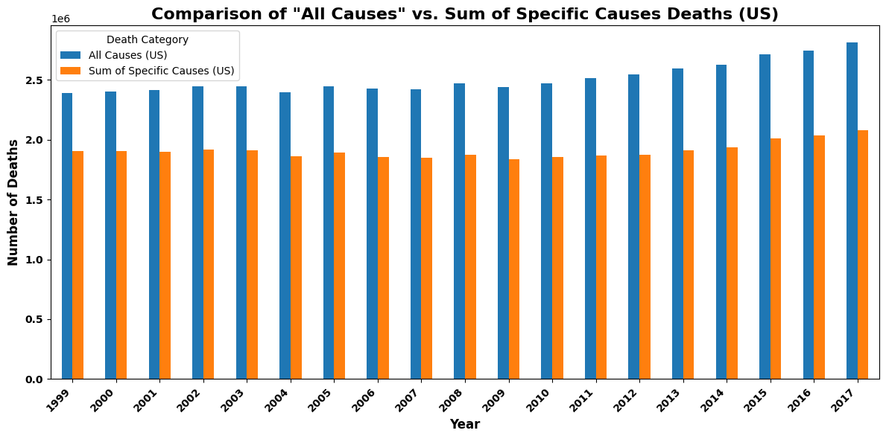
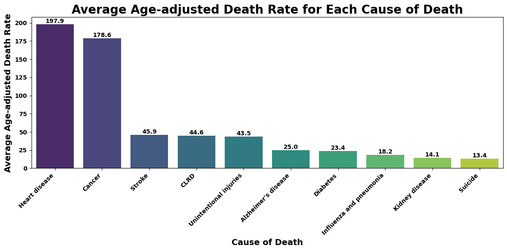
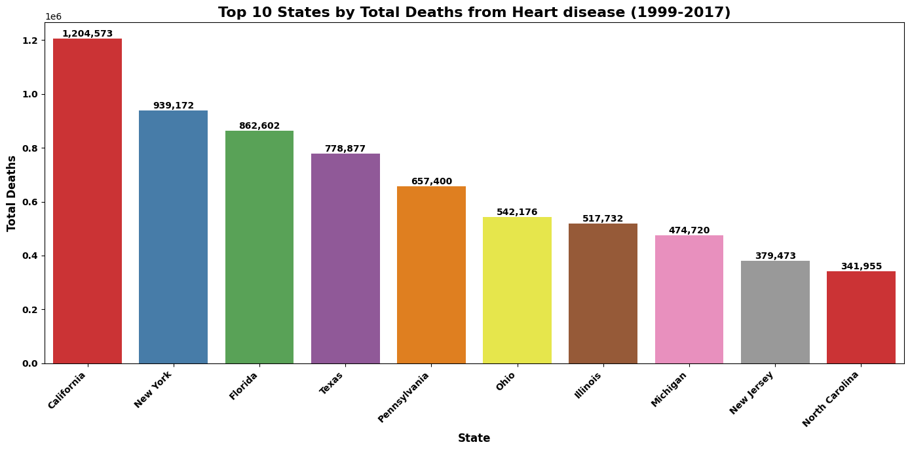
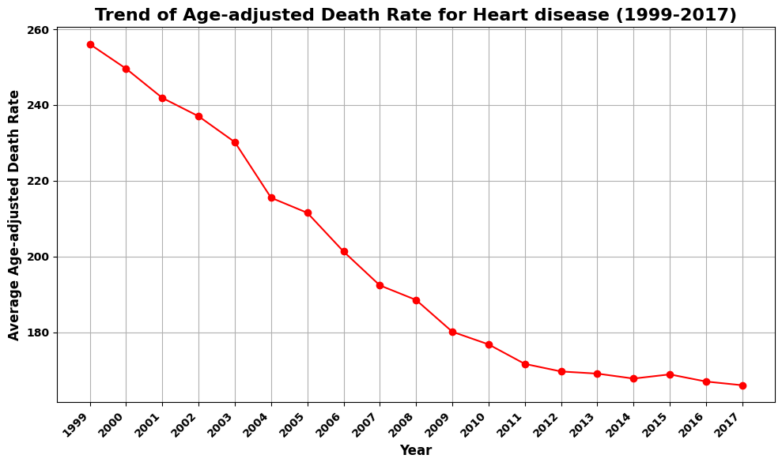
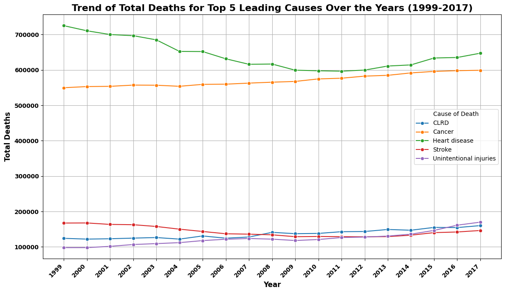
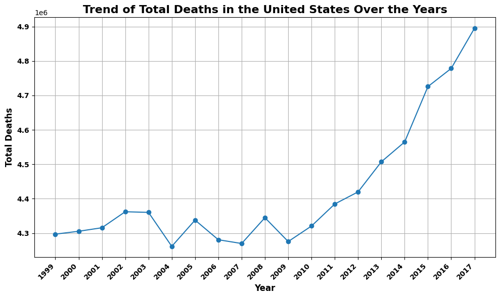

# 📈 EDA PROJECT 5:
#  Unveiling Mortality Trends: A Data-Driven Exploration of Leading Causes of Death in the United States (1999–2017)

## 📌 Project Overview
This project involves my comprehensive exploratory data analysis (EDA) on the NCHS Leading Causes of Death dataset for the United States. I obtained the dataset from the National Center for Health Statistics (NCHS) via data.gov, which provides mortality data by cause of death, state, and year for the period 1999-2017.

My primary objective in this analysis is to gain insights into the patterns and trends of leading causes of death in the United States, including:
- Identifying the most prevalent causes of death.
- Examining how death counts and age-adjusted death rates vary across different states and over time.
- Understanding the relationship between raw death counts and age-adjusted death rates.
- Exploring changes in the ranking of leading causes over the years.
Through this EDA, I aim to uncover key findings that can contribute to a better understanding of mortality in the US and potentially inform public health strategies. Furthermore, this project is part of my public data-science portfolio and showcases reproducible EDA practices, clear visual storytelling, and careful interpretation of population-level health data.

---

## 🧰 Tools & Libraries
- **Python** (Jupyter Notebook)  
- **pandas**, **numpy** for data wrangling  
- **matplotlib**, **seaborn**, **plotly** for visualization  
- **statsmodels / scipy** for basic statistical summaries  
- Git & GitHub for version control and project hosting

---

## 🔍 Key Analysis Steps
1. Data ingestion and validation (NCHS / CDC leading causes dataset).  
2. Data cleaning: handle missing values, standardize cause names, parse dates and states.  
3. Calculation of annual totals and age-adjusted death rates.  
4. Ranking causes by total deaths and age-adjusted rates.  
5. State-level aggregation and comparison for major causes (e.g., heart disease).  
6. Trend analysis over time for top causes and for total deaths.  
7. Visual diagnostics and storytelling — bar charts, line trends, heatmaps.  
8. Short statistical summaries and next-step recommendations for modeling.

---

## ❓ Twelve Key Questions Explored
This analysis was guided by 12 questions designed to uncover timely and actionable patterns in U.S. mortality:

1. **How have total deaths in the U.S. changed over time (year-to-year trend)?**  
2. **How does the total number of deaths from all causes compare to the sum of deaths from the specific leading causes?**  
3. **Which causes are the top 10 contributors to age-adjusted death rates nationally?**  
4. **Which states have the highest total deaths from heart disease?**  
5. **How has the age-adjusted death rate for heart disease evolved over recent decades?**  
6. **What are the time trends of total deaths for the top 5 leading causes?**  
7. **How does the ranking of leading causes change when using age-adjusted rates versus raw counts?**  
8. **Are there visible inflection points (years) where trends accelerate or decelerate for major causes?**  
9. **Which age groups contribute most to the total and age-adjusted death rates for top causes?**  
10. **How do geographic patterns (state-level) differ across major causes?**  
11. **What percentage of all-cause mortality is explained by the top 5 or top 10 causes?**  
12. **Which causes show consistent improvement (declining age-adjusted rates) and which require renewed public-health focus?**

---

## 📊 Key Findings and Implications
> **Based on our comprehensive exploratory data analysis of the NCHS Leading Causes of Death dataset, here are some key findings and their potential implications:**

**Key Findings:**

- **Dominance of Heart Disease and Cancer**: Consistent with national trends, Heart disease and Cancer are the leading causes of death among the specific causes listed. In 2017, Heart disease accounted for approximately 61.0% and Cancer accounted for approximately 56.4% of total deaths from these specific causes (as shown in the answer to Question 15). This highlights the ongoing public health challenge posed by these diseases.
- **Increase in Total Deaths Over Time**: The overall trend of total deaths in the United States shows a general increase from 1999 to 2017 (as shown in the answer to Question 5). This could be attributed to various factors, including population growth, an aging population, or changes in mortality rates for specific causes.
- **Variability Across States**: Death counts and age-adjusted death rates vary significantly across states. For example, in 2017, California, Florida, and Texas had the highest total death counts, while Alaska had the lowest (as shown in the answer to Question 3). This underscores the importance of state-level analysis to understand regional differences in mortality patterns.
- **States with Consistently Higher/Lower Rates**: Our analysis identified states that tend to have consistently higher or lower age-adjusted death rates for specific causes over the years (as shown in the answer to Question 11). For instance, Wyoming had the highest average age-adjusted death rate for both CLRD and Suicide (as shown in the answer to Question 8), while states like New York had the lowest average rates for Alzheimer's disease and Stroke (as shown in the answer to Question 9). This information can be valuable for targeted public health interventions and resource allocation to address disparities.
- **Difference Between Raw Counts and Age-Adjusted Rates**: The notable difference between raw death counts and age-adjusted death rates, particularly in populous states and for high-incidence causes (as shown in the answer to Question 12), emphasizes the importance of using age-adjusted rates for comparing mortality risk across populations with different age structures.
- **Relative Stability in Top Cause Ranking**: While the number of deaths has fluctuated, the relative ranking of the top leading causes of death has remained largely consistent over the years (as shown in the answer to Question 14).

**Implications**:

- The persistent high prevalence of Heart disease and Cancer necessitates continued focus on prevention, early detection, and treatment strategies for these diseases.
- The increasing trend in total deaths highlights the need for ongoing monitoring of mortality rates and further investigation into the contributing factors.
- The significant variations in death rates across states suggest that public health initiatives may need to be tailored to address state-specific challenges and risk factors.
- Identifying states with consistently higher or lower rates for certain causes can help prioritize public health efforts and facilitate the sharing of best practices.
- Using age-adjusted death rates in public health reporting and analysis is crucial for accurate comparisons and informed decision-making, avoiding misleading conclusions based solely on raw death counts.
 

---

## 📸 Visuals (displayed in README)
Place the following image files into an `images/` folder at the repository root so the README will render them:

| Total Deaths vs Sum of Specific Causes | Avg Age-adjusted Death Rate (Top10) |
|----------------------------------------|--------------------------------------|
|  |  |

| Top 10 States by Heart Disease Deaths | Trend: Age-adjusted Death Rate (Heart Disease) |
|---------------------------------------|------------------------------------------------|
|  |  |

| Trend: Total Deaths for Top 5 Causes | Trend: Total Deaths in the U.S. Over the Years |
|--------------------------------------|------------------------------------------------|
|  |  |

> **Important:** ensure the filenames in `images/` exactly match the names above (including spaces/casing) or rename files to simplified names and update the README image links accordingly.

---

## 📁 Files in This Repository
- `EDA_Project_5_US_Mortality_Trends.ipynb` — Jupyter notebook with full data pipeline, EDA code, tables, and figures  
- `images/` — plot PNGs used in the README and analysis  
- `data/` — (optional, small aggregated CSVs or snapshots). The raw NCHS/CDC data are not included here due to size and licensing — see Dataset Access below.  
- `README.md` — this file

---

## 📂 Dataset Access & Sources
Primary data sources and references used in this analysis (add or replace with the exact source links you used in the notebook):  
- NCHS / CDC — Leading Causes of Death datasets (publicly available via CDC WONDER or NCHS data portals)  
- [CDC WONDER](https://wonder.cdc.gov/) (for cause-specific and demographic mortality data)  
- (If applicable) Kaggle or other aggregated CSVs used for prototyping

> Note: always cite the precise dataset version and extraction date in the notebook (`Data source:` cell) to ensure reproducibility.

---

## 🚀 Next Steps / Recommendations
1. **Statistical testing:** test year-to-year changes and trend breakpoints using time series tests (e.g., Mann-Kendall, segmented regression).  
2. **Standardization:** standardize filenames and column names; generate a small `data/README` documenting preprocessing steps.  
3. **Modeling:** build short-term forecasting models for top causes (e.g., ARIMA or Prophet), and consider cause-specific modeling for policy simulation.  
4. **Geospatial analysis:** map state-level rates to identify clusters and hotspots.  
5. **Policy brief:** convert key visuals into a 1-page brief for public health stakeholders summarizing priority causes and states.

---

## ✍️ Author
**Dr. Adebayo Fashina** — PhD (Physics) transitioning into Data Science & Public Health Analytics  
📍 Toronto, Canada | [GitHub](https://github.com/dradebayotech) | [LinkedIn](https://www.linkedin.com/in/your-link-here)

---

## 📌 How to get this README visuals to render
1. In the repo root create an `images/` folder. (Web: *Add file → Create new file → images/.gitkeep*)  
2. Upload the six plot PNGs into `images/`. Consider renaming files to remove spaces (e.g., `allcauses_vs_sum.png`) and update the README links accordingly.  
3. Commit `EDA_Project_5_US_Mortality_Trends.ipynb`, `images/`, and `README.md`.

---

If you want I can now:
- (A) produce a copy-ready `README.md` file (exact markdown) with simplified image filenames (no spaces) and provide the shell commands/git steps to upload everything; **or**  
- (B) extract exact figures and write more quantitative findings from your notebook (I’ll need the notebook re-opened or you to paste key numeric outputs/summary tables).

Which would you like me to do next?
